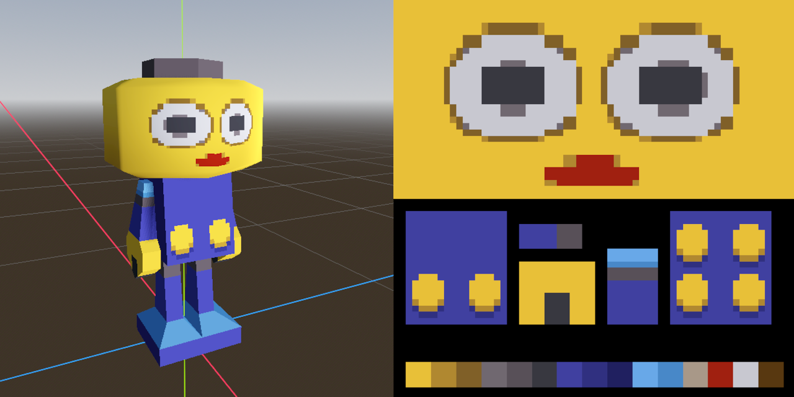

# Animation system for [godot-mapper](https://github.com/ELF32bit/godot-mapper) plugin
 

## Explanation (for TrenchBroom maps)
Maps inside `characters` directory are scanned for layer names like **RUN->3.5**, **IDLE->0**. 
The build system will then construct the animation table that switches visibility of the layers. 
`info_animation` entity stores additional animation parameters as `RUN | { "loop_mode": 1 }`. 
* **`loop_mode`** can be 0 (none), 1 (loop), 2 (ping pong). 1 is default.
* **`frame_duration`** multiplies layer number (frame number) by the duration.
* **`fade`** is an array of fade percentages like [0.5, 0.75, 0.9] for previous frames.
* **`fade_before`** set to False will disable after-images of previous frames.
* **`fade_after`** set to True will enable after-images for future frames.

`info_animation` also supports the specified properties. 
* **`autoplay`** animation name will be used as the default animation.
* **`fade_visibility_end`** distance after which after-images will be hidden.
* **`visibility_end`** distance in units. 0 is default, meaning disabled.

Animation layers can contain special point and brush entities. 
For example, certain frames might need hit boxes or moving lights. 
All other layers will be parsed as the global **`STORAGE`** node. 

## Transparent after-images
Characters must use override shader materials with **`fade`** property from 0 to 1. 
Furthemore, the materials need to have **`depth_prepass_alpha`** render mode. 
Depth prepass is disabled in **Mobile** renderer, so there is a workaround. 
 
Override materials can provide **`fade_material`** metadata with a simpler transparency. 
If the override material provides such metadata, then it itself should not use **`fade`** property. 
The animation system will then use different materials for the character and the after-images. 
However, [animation player cache interferes](https://github.com/godotengine/godot/issues/34335) with switching mesh materials during the playback. 
